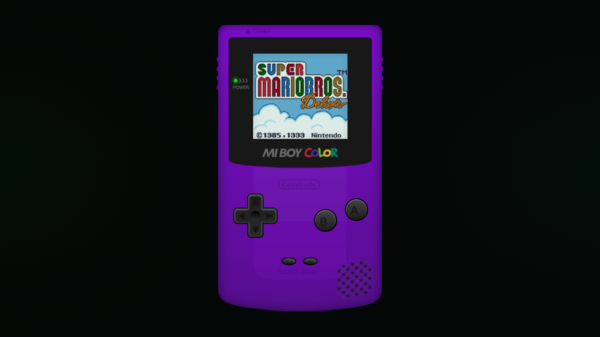
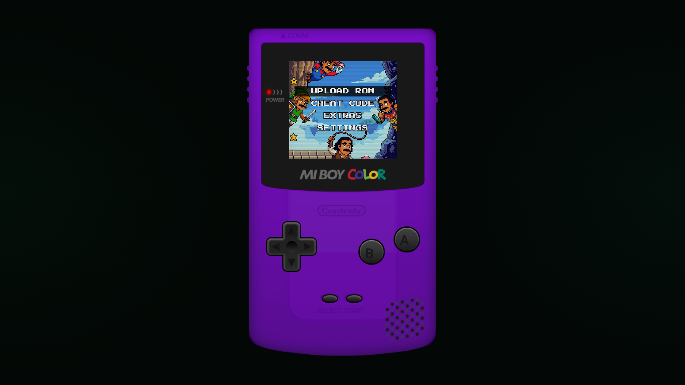

# Mi Boy Color

Mi Boy Color is a browser-based handheld built in [DoodleDev](https://doodledev.app/), with a responsive device shell, on-device menus, keyboard controls, sound, and playable games.

[Open the DoodleDev Builds gallery](https://doodledev.app/builds/) · [Launch Mi Boy Color](https://mitchivindesign.github.io/miboy/) · [Visit MitchIvin XP](https://mitchivin.com/)

## About this repository

This is the public project page for Mi Boy Color. It contains project information and screenshots; the working product source and deployment are maintained privately.

The canonical shared device behavior and states are maintained with MitchIvin XP. The standalone edition adds its own full-page presentation and deployment packaging without forking those shared behaviors.

Mi Boy Color is an independent creative project and is not affiliated with Nintendo.
